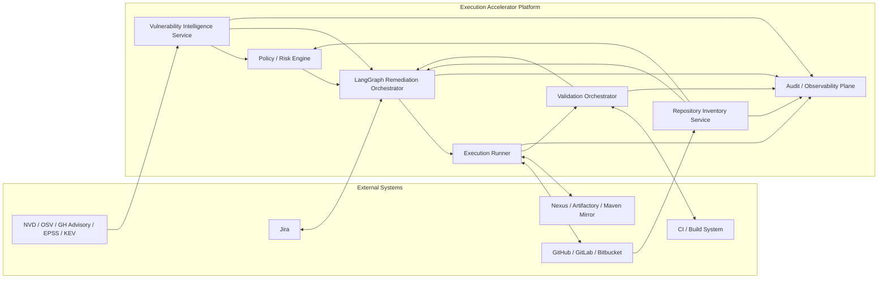
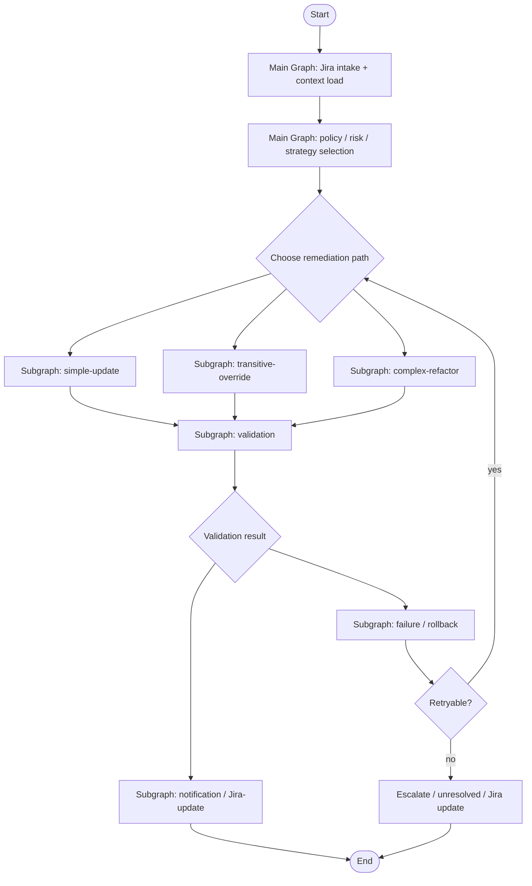

# Execution Accelerator

Execution Accelerator is a **Jira-driven, LangGraph-orchestrated vulnerability remediation platform** designed for **full automation**, including:

- direct dependency upgrades
- transitive dependency overrides
- EOL dependency replacement
- backward-incompatible JAR migrations
- code changes required to safely land those migrations
- validation, rollback, PR creation, and Jira status updates

The product goal is simple:

> Take a Jira vulnerability/remediation ticket, understand the affected dependency and repositories, choose the right remediation path, apply the fix, validate it, and push the result with minimal or no human intervention.

---

## Core principles

1. **Jira is the control plane**
   - intake
   - approvals/governance
   - progress tracking
   - final remediation status

2. **LangGraph is the remediation brain**
   - routing
   - stateful execution
   - retries
   - rollback handling
   - subgraph composition

3. **Deterministic automation first**
   - Maven resolution
   - dependency metadata verification
   - OpenRewrite-style rewrites where possible
   - compatibility diffing for hard migrations

4. **Agentic repair second**
   - bounded, evidence-driven code generation only when deterministic methods are insufficient

5. **Validation is mandatory**
   - compile
   - tests
   - vulnerability re-scan
   - artifact-level verification

6. **Full automation is the target**
   - human review exists as fallback/governance, not as the intended steady-state path

---

## Target end state

Execution Accelerator is intended to fully automate remediation across the full difficulty spectrum:

- **simple path**
  - direct version bump in `pom.xml`
  - dependencyManagement override
  - safe transitive fix

- **tough path**
  - EOL library replacement
  - backward-incompatible upgrade
  - old/new JAR decompilation
  - API diffing
  - symbol mapping
  - code changes
  - validation and safe push

---

## System architecture



### Architecture interpretation

- **Jira** is the required workflow entry and status system.
- **Vulnerability Intelligence Service** normalizes external advisory data.
- **Repository Inventory Service** understands repositories, dependency trees, ownership, and CI shape.
- **Policy / Risk Engine** determines what is allowed to run automatically.
- **LangGraph Remediation Orchestrator** owns the remediation workflow.
- **Execution Runner** is the only component that writes code and pushes branches.
- **Validation Orchestrator** verifies that the fix is real.
- **Audit / Observability Plane** records the entire lifecycle.

---

## Execution pipeline

This is the closest runtime view of how the product is intended to behave.

```text
+--------+      +------------------+      +------------------+      +------------------------------+
| JIRA   | ---> | Intake / Parser  | ---> | GIT FETCH        | ---> | MAVEN / ADVISORY VERIFY      |
| ticket |      | CVE/lib/version  |      | clone + inspect  |      | fixed version + dep resolve  |
+--------+      +------------------+      +------------------+      +------------------------------+
                                                                                   |
                                                                                   v
                                                      +----------------------------------------------+
                                                      | LangGraph Decision Router                    |
                                                      | simple path OR EOL/incompatible tough path   |
                                                      +----------------------------------------------+
                                                           |                                   |
                                                           |                                   |
                                                           v                                   v
                                +--------------------------------------+   +--------------------------------------+
                                | Simple path subgraph                 |   | Tough path / complex subgraph       |
                                | bump pom / depMgmt / safe override   |   | jar fetch -> decompile -> diff      |
                                +--------------------------------------+   | map -> code changes                 |
                                                           |               +--------------------------------------+
                                                           |                                   |
                                                           +-------------------+---------------+
                                                                               |
                                                                               v
                                                           +--------------------------------------+
                                                           | GIT APPLY CHANGE                     |
                                                           | write pom/code diff in workspace     |
                                                           +--------------------------------------+
                                                                               |
                                                                               v
                                                           +--------------------------------------+
                                                           | Validation subgraph                  |
                                                           | Maven compile / tests / scan / verify|
                                                           +--------------------------------------+
                                                                               |
                                                              +----------------+----------------+
                                                              |                                 |
                                                              v                                 v
                                            +--------------------------------+   +----------------------------------+
                                            | GIT PUSH / PR + Jira update    |   | Failure / rollback / retry      |
                                            | success path                    |   | retry loop or unresolved status |
                                            +--------------------------------+   +----------------------------------+
```

### Pipeline interpretation

1. **Jira ticket** is the start signal.
2. The system extracts the vulnerable library, version, CVE/advisory references, and remediation context.
3. It clones and inspects the repository.
4. It verifies the target/fixed version against Maven and advisory intelligence.
5. LangGraph routes execution into the right subgraph.
6. All paths converge into validation.
7. Only validated changes are pushed.
8. Failure triggers retry, rollback, or unresolved Jira status.

---

## LangGraph remediation brain



### Subgraphs

#### 1. Simple-update subgraph
- direct dependency bump
- safe `pom.xml` update
- dependencyManagement override
- preflight dependency resolution

#### 2. Transitive-override subgraph
- identify indirect dependency issue
- apply override strategy
- verify no BOM conflict silently cancels the change

#### 3. Complex-refactor subgraph
- fetch old/new artifacts
- decompile JARs
- derive compatibility diff
- build old-to-new symbol mapping
- apply deterministic migration where possible
- use bounded code generation for residual gaps

#### 4. Validation subgraph
- Maven compile
- unit/integration tests
- security scan re-run
- artifact-level verification

#### 5. Failure / rollback subgraph
- classify failure
- retry when safe
- rollback when needed
- escalate unresolved cases

#### 6. Notification / Jira-update subgraph
- Jira comments
- status transitions
- remediation summary

---

## Simple path

The simple path handles the majority of routine fixes:

1. identify vulnerable dependency
2. verify fixed version from advisory + Maven metadata
3. update `pom.xml`
4. update `dependencyManagement` if required
5. resolve dependencies
6. compile and test
7. re-scan
8. create branch, commit, push, PR
9. update Jira

This is the high-confidence, high-throughput lane.

---

## Tough path: EOL and backward-incompatible upgrades

This path exists for:

- EOL dependencies
- major version jumps
- incompatible APIs
- replacement-library migrations

### Tough path flow

1. fetch current and candidate replacement artifacts
2. decompile old/new JARs
3. diff the public APIs
4. build mapping between old and new methods/classes
5. decide deterministic vs generated changes
6. apply code changes
7. run full validation
8. retry/repair if bounded failures are fixable
9. push only if validation succeeds

### Tough path design rule

**Diff first, generate second.**

The system should rely on deterministic evidence before it asks any model to modify source code.

---

## Full automation strategy

To make full automation credible, the platform needs an autonomy ladder:

1. **autonomous direct upgrades**
2. **autonomous transitive remediation**
3. **autonomous deterministic migrations**
4. **autonomous bounded refactor generation**
5. **autonomous rollback and escalation**

Human review is still supported, but the intended steady state is that the system resolves the common and many advanced cases on its own.

---

## Final build plan

### Phase 1: foundation
- Jira integration
- vulnerability intelligence normalization
- repository inventory
- audit/event storage

### Phase 2: main graph
- Jira intake node
- context load node
- Maven/advisory verification node
- router node
- status update node

### Phase 3: simple path
- direct dependency bump
- dependencyManagement override handling
- pom mutation
- preflight checks

### Phase 4: tough path
- artifact fetch
- decompilation
- compatibility diffing
- symbol mapping
- bounded code-change generation

### Phase 5: validation and rollback
- compile
- tests
- security scan
- artifact verification
- retry
- rollback
- unresolved Jira state

### Phase 6: PR completion
- branch creation
- commit
- push
- PR creation/update
- final Jira transition/comment

---

## Final implementation priority

### Priority 1
- Jira + Git + Maven + simple path + validation + PR/Jira update

### Priority 2
- transitive override handling
- richer policy/risk scoring

### Priority 3
- tough path for EOL / backward-incompatible jars

### Priority 4
- full autonomous retry/repair loops
- broader ecosystem support

---

## Why this architecture

This architecture balances three things:

1. **control**
   - Jira + audit + policy

2. **automation**
   - LangGraph + subgraphs + execution runner

3. **safety**
   - deterministic evidence
   - validation gates
   - rollback paths

It is designed to support the actual target:

> **complete automation of vulnerability remediation, including hard EOL and backward-incompatible migration cases, without losing traceability or control.**

---

## Current implementation status

The repository currently includes the Day 1 foundation, Day 2 bootstrap, and the Day 3 local intake path:

- typed Pydantic workflow schemas
- typed `RemediationState`
- local SQLite checkpoint wiring for LangGraph
- fixture-backed Jira intake adapter
- fixture-backed repository inventory and intake adapter
- a compiled remediation graph that boots, ingests Jira context, resolves repositories, and persists state
- CLI support to bootstrap a persisted ticket run locally and print the discovered Day 3 intake context

### Local bootstrap example

```bash
python -m execution_accelerator --bootstrap-ticket SEC-123 --thread-id sec-123-dev
```

This creates the local runtime directories when needed, persists checkpoints to `.local/data/checkpoints.sqlite` by default, loads the Day 3 fixture-backed Jira and repository inventory context, and prints the resulting package and repository intake summary.

### Inspecting a persisted thread

```bash
python -m execution_accelerator --show-thread-state sec-123-dev
```

This prints the current persisted workflow summary for the requested thread so local Day 3 intake runs can be inspected without opening the SQLite checkpoint store directly.
