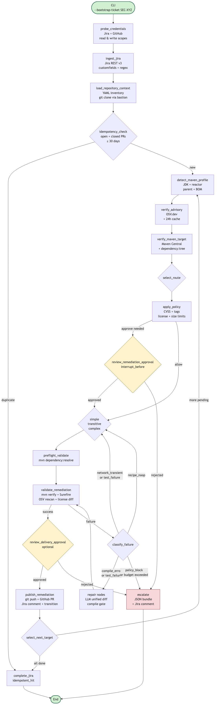
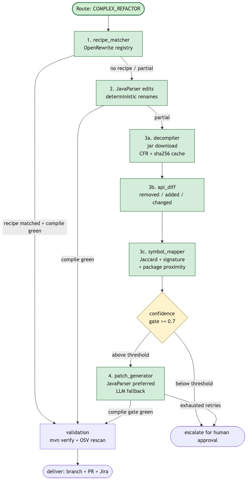

# Execution Accelerator

> Jira-driven, LangGraph-orchestrated Maven vulnerability remediation. Deterministic-first with bounded LLM fallback for tough EOL / backward-incompatible JAR migrations.


You hand it a Jira ticket pointing at a vulnerable Maven dependency. It clones the repo, verifies the advisory against OSV.dev, picks one of three remediation lanes (direct bump, transitive override, or complex EOL migration), mutates the workspace via OpenRewrite or deterministic Java rewrites, runs `mvn verify`, and opens a draft pull request. Every step is checkpointed to SQLite so any run can be resumed; every external secret is redacted from logs and LLM prompts.

---

## Architecture



The lifecycle is one Pydantic-typed `RemediationState` flowing through a LangGraph state machine. Adapters fan out to Jira REST, OSV.dev, Maven Central, `git`, `mvn`, `mvn rewrite`, and GitHub REST. Two `interrupt_before` gates pause for human approval; failures route through a classified-retry matrix with bounded budgets per ticket.

---

## The tough path: EOL & backward-incompatible JARs

When a simple version bump cannot work — major-version migrations, removed APIs, replaced constructors — the workflow runs a four-step ladder. Each step has a compile gate; deterministic options are tried before any LLM call.



| Step | Module | What it does |
|---|---|---|
| 1 | `tough_path/recipe_matcher.py` | Look up a community OpenRewrite recipe (JUnit 4→5, commons-lang 2→3, javax→jakarta, JodaTime→java.time) for the version jump. |
| 2 | `nodes/remediation.py` | Deterministic Java rewrites — method calls, constructors, static imports, references, helper-shim generation. |
| 3a | `tough_path/decompiler.py` | Download old + new JARs from Maven Central, sha256-keyed cache, decompile via CFR. |
| 3b | `tough_path/api_diff.py` | Walk decompiled sources, extract every public class/method/field, classify removed/added/changed. |
| 3c | `tough_path/symbol_mapper.py` | Score replacement candidates (token Jaccard + signature + package proximity). LLM enrichment is bounded by `final = min(deterministic, llm)` — the LLM cannot inflate trust beyond the similarity score. |
| 4 | `nodes/repair.py` + LLM | Last-resort patch generation, capped at 10 files / 500 lines per attempt, every patch `mvn compile`-gated before it lands. |

---

## Quickstart

```bash
git clone https://github.com/srivastavapalak96/execution-accelerator.git
cd execution-accelerator
python3 -m venv .venv && source .venv/bin/activate
make install            # pip install -e ".[dev]"
make test               # 312 unit tests, ~25 s
```

Run a fixture-backed end-to-end ticket through the full graph:

```bash
python -m execution_accelerator --bootstrap-ticket SEC-123 --thread-id sec-123-dev
python -m execution_accelerator --status sec-123-dev
```

Smoke targets exercise each lane (`make remediate-smoke`, `make transitive-smoke`, `make complex-smoke`, `make validation-failure-smoke`).

---

## Components

```
src/execution_accelerator/
├── adapters/                    # EA_MODE-dispatched: jira, repository_inventory,
│   │                            # verification, pom, validation, delivery, complex
├── execution/                   # subprocess wrappers
│   ├── sandbox.py               # subprocess + log redaction
│   ├── git_runner.py            # bastion-aware git CLI
│   ├── maven_runner.py          # mvn + settings.xml
│   ├── openrewrite_runner.py    # mvn rewrite-maven-plugin:run
│   └── surefire_parser.py       # defusedxml report parsing
├── services/                    # advisory.py (OSV), version_range.py (Maven semver)
├── llm/                         # client + structured + redact + budget
├── tough_path/                  # recipe_matcher, decompiler, api_diff, symbol_mapper
├── policy/                      # YAML-driven CVSS / tag / license rules
├── profiles/                    # JDK / reactor / parent / BOM detection
├── observability/               # audit JSONL + metrics CSV + escalation bundles
├── nodes/                       # LangGraph node bodies
├── subgraphs/                   # composition for simple/transitive/complex/validation/delivery
├── graph/builder.py             # StateGraph + interrupts + retry edges
├── state.py + schemas.py        # Pydantic contracts
└── persistence.py               # SQLite checkpointer
```

---

## Live mode

`EA_MODE=live` swaps every fixture for a real-system call. Configure once:

```bash
# config/repositories.yaml — repo inventory (clone URL, manifest, bastion, settings.xml)
# config/jira.yaml         — customfield IDs + transition map
# config/policy.yaml       — CVSS gates, tag rules, license allow/deny lists, size limits
```

Then export credentials:

```bash
export EA_MODE=live
export EA_JIRA_BASE_URL=... EA_JIRA_TOKEN=... EA_JIRA_EMAIL=...
export EA_JIRA_PROBE_TICKET=SEC-PROBE-1   # write-scope check
export GITHUB_TOKEN=... GITHUB_OWNER=...
export EA_GIT_USER_NAME="..." EA_GIT_USER_EMAIL="..."
export EA_LLM_PROVIDER=ollama EA_LLM_MODEL=llama3.1:8b   # optional; bounded LLM
export EA_GPG_SIGNING_KEY=...                            # optional; signed commits
```

A run starts with a credential probe that verifies both **read and write** scopes before any work begins. Use `--dry-run` first; resume approval-gated runs with `--resume {thread} --approval-decision approved|rejected`.

---

## Safety boundaries

- **No LLM is invoked for simple bumps, transitive overrides, route selection, or Jira parsing.** Recipe matchers and OpenRewrite carry the deterministic load.
- **Every patch is compile-gated before it persists.** `git apply --check` then `mvn compile`; rejected patches do not land.
- **Per-ticket LLM budgets.** Hard ceiling of 20 calls / 100,000 tokens by default (`EA_MAX_LLM_CALLS_PER_TICKET`, `EA_MAX_LLM_TOKENS_PER_TICKET`); `LlmBudgetExceeded` triggers escalate.
- **Prompt redaction.** Known credential shapes (`ghp_*`, `Bearer ...`, `AKIA*`, `<password>...</password>`, basic-auth URLs) are stripped before any prompt leaves the process. Hosted providers refuse to send if a credential pattern survives redaction.
- **Validation gates everything.** No PR without `mvn verify` green, OSV rescan via version-range evaluation, and a license-diff check.
- **Idempotency.** Re-running a completed ticket short-circuits to `idempotent_hit` after searching open and recently-closed (≤30 days) PRs.

---

## CLI

```text
--bootstrap-ticket TICKET    Start a new run for the given Jira ticket id
--thread-id THREAD           Stable LangGraph thread id (default: ticket-{id})
--resume THREAD              Resume a checkpointed thread
--approval-decision X        approved | rejected (with --resume)
--reviewer / --approval-comments
--dry-run                    Stop before push / PR / Jira write
--keep-workspace             Preserve the cloned workspace
--show-thread-state THREAD   Print persisted state summary
--status THREAD              Operator-friendly summary + next-action hint
--abort THREAD               Mark a thread failed; record operator_abort
--probe-llm                  Verify the configured LLM provider end-to-end
--show-config                Print resolved runtime config
--version
```

---

## Testing

```bash
make test                                              # 312 unit tests, ~25 s
EA_INTEGRATION=1 pytest tests/integration -q           # 8 integration tests, real systems
ruff check src tests
mypy --strict src                                      # 63 source files
```

The integration suite hits real OSV.dev, real `mvn` (via Maven Central), and real `git` (against a tmp bare repo) using a checked-in sample Maven project pinned to `commons-text 1.9` (CVE-2022-42889). It is gated by `EA_INTEGRATION=1` and runs on a nightly cron in CI.

---

## Configuration reference

| Variable                       | Default                              | Purpose |
|--------------------------------|--------------------------------------|---------|
| `EA_MODE`                      | `fixture`                            | `fixture` \| `live` |
| `EA_LLM_PROVIDER`              | `ollama`                             | `ollama` \| `anthropic` \| `openai` |
| `EA_LLM_MODEL`                 | `llama3.1:8b`                        | Model tag |
| `EA_OLLAMA_BASE_URL`           | `http://localhost:11434`             | Ollama HTTP endpoint |
| `EA_MAX_RETRIES`               | `3`                                  | Per-failure-class retry budget |
| `EA_MAX_TOTAL_ATTEMPTS`        | `10`                                 | Hard ceiling across all retries |
| `EA_MAX_LLM_CALLS_PER_TICKET`  | `20`                                 | Per-ticket LLM call budget |
| `EA_MAX_LLM_TOKENS_PER_TICKET` | `100000`                             | Per-ticket LLM token budget |
| `EA_GITHUB_API_BASE`           | `https://api.github.com`             | Override for GitHub Enterprise |
| `EA_MAVEN_SETTINGS`            | —                                    | Path to settings.xml (per-repo overridable) |
| `EA_GPG_SIGNING_KEY`           | —                                    | Optional commit-signing key id |
| `EA_DRY_RUN`                   | `0`                                  | Skip push / PR / Jira write |
| `EA_INTEGRATION`               | `0`                                  | Run real-systems test suite |

Credentials live in `EA_JIRA_*`, `GITHUB_TOKEN`, and `EA_GIT_USER_*`. They are **never** persisted to SQLite checkpoints, log files, or LLM prompts.

---

## License

MIT — see [`LICENSE`](LICENSE).

---

## Diagrams

The two architecture diagrams above are committed under `docs/diagrams/` as both `.mmd` (Mermaid source) and rendered `.png` / `.svg`. Re-render after any flow change:

```bash
npx -y @mermaid-js/mermaid-cli -i docs/diagrams/architecture.mmd -o docs/diagrams/architecture.png --backgroundColor white --width 1600
npx -y @mermaid-js/mermaid-cli -i docs/diagrams/tough-path.mmd  -o docs/diagrams/tough-path.png  --backgroundColor white --width 1400
```
